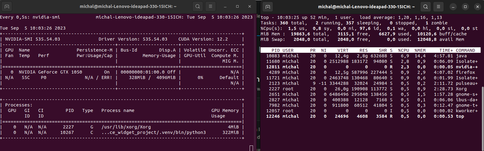
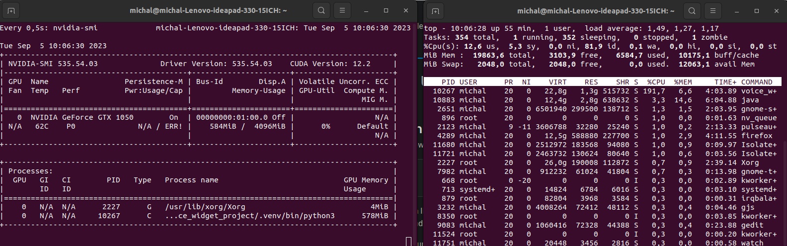

Readme contents:
====================
1) About voice input widget
2) How to run the code?
3) Faster whipser
4) Parsing arguments
5) How to choose the function button
6) CPU/GPU usage
7) Project organization


1\. About voice input widget
====================

Application that enables pseudo-real-time voice inputting in any text field. To improve performance and lower memory and gpu requirements app uses Faster Whisper model which is Whisper model rewritten in C++. Pressing the button (default one of the function buttons on the mouse - configurable) starts recording from audio device (default audio device for the computer - configurable). Audio is recorded and transcripted while the button is pressed. For better accuracy app prints one sentence back, what allows to keep the correct context. Every time the sentence is printed the initial part of audio becomes unnecessary, so it's deleted according to end of sentence time stamps.


2\. How to run the code?
====================

2.1) Clone repo: 
```bash
git clone https://github.com/saworz/widget-voice-text-input.git
```

2.2) Change dir: 
```bash
cd widget-voice-text-input
```

2.3) Create env: 
```bash
python3 -m venv /path/to/new/virtual/environment
```

2.4) Activate env: 
```bash
source /path/to/new/virtual/environment/bin/activate
```

2.5) Install requirements: 
```bash
python3 setup.py install
```

2.6) Run script: 
```bash
voice_widget
```

3\. Faster whisper
====================
For GPU support please refer to Faster Whisper's Github, cuBLAS 11.x and cuDNN 8.x are required.
https://github.com/guillaumekln/faster-whisper


4\. Parsing arguments
====================

Project can be run with arguments:

--model -> string: size of the model. type `voice_widget --help` to see possible sizes and default values.

--audio -> int: audio device ID. Indexes can be checked by running `show_audio_devices.py` script.

--gpu -> bool: True for gpu (if cuda is available), False for cpu.

--button -> string: button used to control voice recording.

Without parsing arguments script will run with default values saved in config.ini. Parsed arguments overwrite config file.
Sample run command: 
```bash
voice_widget --model small.en --audio 9 --gpu True --button button9
```


5\. How to choose the function button?
====================

Run a command to open Event Window then press desired button and read its name from terminal

Check Events: 
```bash
xev
```

:Sample output: 
```bash
ButtonRelease event, serial 37, synthetic NO, window 0x2c00001,
    root 0x910, subw 0x0, time 47100795, (122,110), root:(172,197),
    state 0x10, button 9, same_screen YES
```

So we can use this button by passing argument --button button9


6\. CPU/GPU usage
====================

Script in idle state (waiting for input) takes about ~320MB of GPU memory and uses negligible CPU. 


While busy (recording and translating) GPU peaks at around ~600MB and up to 2 CPU cores.


7\. Project Organization
====================

     ├── setup.py           			<- makes project pip installable (pip install -e .) so src can be imported
     │
     ├── requirements.txt   			<- The requirements file for reproducing the analysis environment, e.g.
     │              	           		generated with `pip freeze > requirements.txt`
     ├── README.md          			<- The top-level README for developers using this project.
     │
     └── voice_widget
        ├── recorded_audio.wav			<- File with last saved audio.
        │
        ├── show_audio_devices.py 			<- Script to print indexes of available audio devices
        │
        ├── __init__.py    				<- Makes voice_widget a Python module
        │
        └── src                			<- Source code for use in this project.
	   	 ├── __init__.py    			<- Makes src a Python module
	   	 │
	   	 ├── audio_file_functions		<- Scripts handle audio recording
	   	 │   └── __init__.py    		<- Makes audio_file_functions a Python module
	   	 │   └── audio_setup.py			<- Gets audio devices ids and audio parameters
	   	 │   └── cutting_audio.py		<- Used to cut unnecessary audio that has already been trascripted
	   	 │   └── read_audio.py			<- Read data from .wav file
	   	 │   └── save_audio.py			<- Save data as .wav file
	   	 │
	   	 ├── button_trigger			<- Handling recording trigger
	   	 │   └── __init__.py    		<- Makes button_trigger a Python module
	   	 │   └── click_function_button .py	<- Starting and stopping recording
	   	 │
	   	 ├── model        			<- Script to load model
	   	 │   └── __init__.py    		<- Makes model a Python module
	   	 │   └── model_loading.py		<- Model loading
	   	 │
	   	 ├── run_settings			<- App settings
	   	 │   └── __init__.py    		<- Makes run_settings a Python module
	   	 │   └── base_logger.py			<- Logger config
	   	 │   └── data_parsing.py		<- Data parser config
	   	 │
	   	 ├── threads_handling			<- Handles threads
	   	 │   └── __init__.py    		<- Makes threads_handling a Python module
	   	 │   └── threads_handler.py		<- Threads and events manager
	   	 │   	
	   	 ├── voice_record			<- Voice recording
	   	 │   └── __init__.py    		<- Makes voice_record a Python module
	   	 │   └── voice_input.py			<- Handles audio recording
	   	 │   	
	   	 └── voice_to_text			<- Audio transcription
	   	     └── __init__.py    		<- Makes voice_to_text a Python module
	       	     └── voice_transcriptions.py	<- Creating text from audio


--------

<p><small>Project based on the <a target="_blank" href="https://drivendata.github.io/cookiecutter-data-science/">cookiecutter data science project template</a>. #cookiecutterdatascience</small></p>
